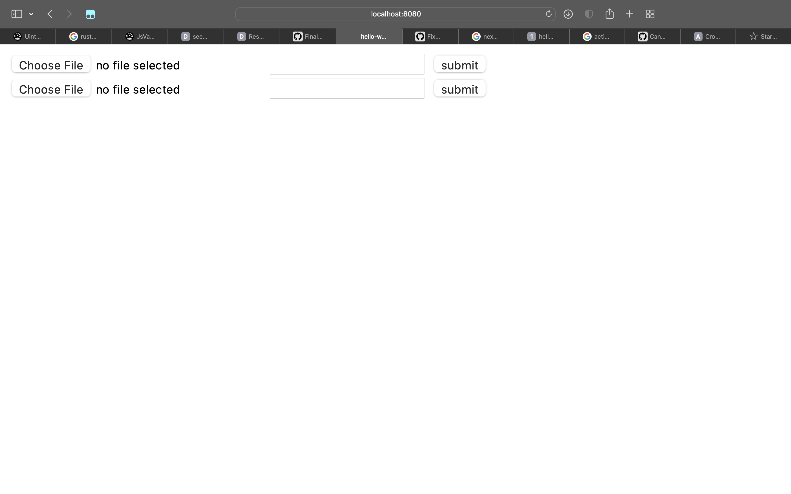

# SM4 Machine

A SM4 implementation with web frontend.

This is a coursework. 

**DO NOT USE IT IN PRODUCTION**
## Usage
### Dependency

- Rust Nightly with Cargo
  ```
  curl --proto '=https' --tlsv1.2 -sSf https://sh.rustup.rs | sh
  rustup default nightly
  ```
- wasm-pack
  ```
  cargo install wasm-pack
  ```
- NodeJS
  ```
  curl -o- https://raw.githubusercontent.com/nvm-sh/nvm/v0.39.1/install.sh | bash
  nvm install node
  ```
  See https://heynode.com/tutorial/install-nodejs-locally-nvm/

### Serve

```sh
# clone this repo
git clone https://github.com/FinalCrypto/SM4_Machine.git

# build wasm
cd sm4_backend
wasm-pack build

# run server
cd ..
npm run serve

# now your web server is running on http://127.0.0.1:8080
```
  
Currently this application looks like this:



